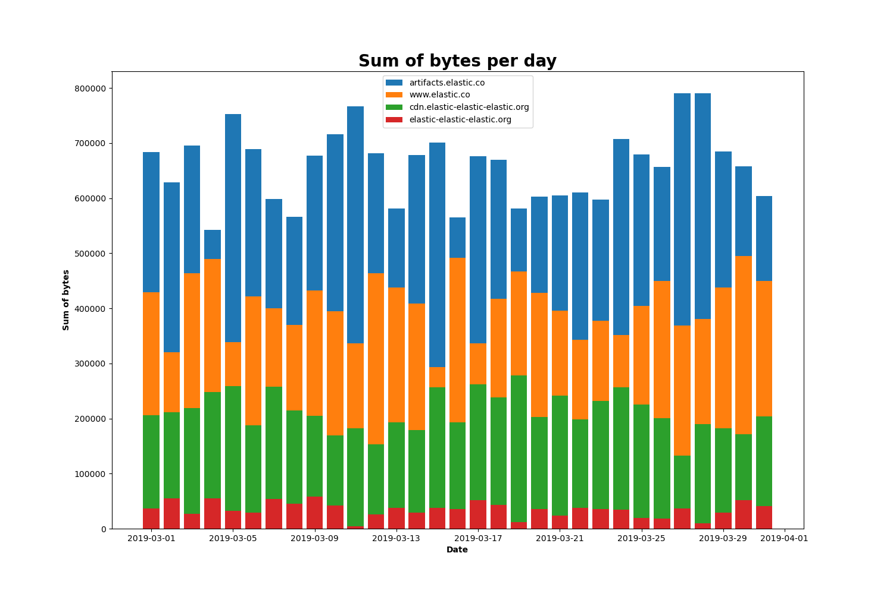

# Тестовое задание по работе с данными, хранящимися в Elasticsearch.


## Установка

`git clone https://github.com/dmtrbrlkv/Elastic`

Желательно создать virtualenv

```
cd Elastic
python -m venv venv
source venv/bin/activate
```

Перед запуском установить зависимости

`pip install -r requirements.txt`

## Запуск

#### Загрузка полетов в Elasticsearch

```
python load_flights.py
```
```
optional arguments:
  -h, --help            show this help message and exit
  -H HOST, --host HOST  Elasticsearch host, default = localhost
  -P PORT, --port PORT  Elasticsearch port, default = 9200
```

#### Загрузка логов в Elasticsearch

```
python load_logs.py
optional arguments:
  -h, --help            show this help message and exit
  -H HOST, --host HOST  Elasticsearch host, default = localhost
  -P PORT, --port PORT  Elasticsearch port, default = 9200
```

#### Среднее значение задержки рейсов

```
python avg_delay.py
```
```
optional arguments:
  -h, --help            show this help message and exit
  -H HOST, --host HOST  Elasticsearch host, default = localhost
  -P PORT, --port PORT  Elasticsearch port, default = 9200
  -f FILENAME, --filename FILENAME
                        File to import, default = delays.csv

```

##### Пример

delays.csv:

Carrier | Average FlightDelayMin
------------ | -------------
Logstash Airways |48.27037773359841
JetBeats |45.814070351758794
Kibana Airlines | 45.96160438806994
ES-Air  | 47.24120082815735


#### Сумма байт за каждый день для каждого хоста

```
python sum_bytes.py
```
```
optional arguments:
  -h, --help            show this help message and exit
  -H HOST, --host HOST  Elasticsearch host, default = localhost
  -P PORT, --port PORT  Elasticsearch port, default = 9200
  -b BEGIN, --begin BEGIN
                        Beginning of period in 'YYYY-MM-DD' format, default =
                        2019-03-01
  -e END, --end END     End of period in 'YYYY-MM-DD' format, default =
                        2019-04-01
  -f FILENAME, --filename FILENAME
                        File to import, default = bytes.csv
  -i IMAGENAME, --imagename IMAGENAME
                        File to import, default = bytes.png


```

##### Пример

bytes.csv:

Date | Host | Sum of bytes
------------ | ------------- | -------------
20.03.2019 | artifacts.elastic.co | 603079.0
20.03.2019 | www.elastic.co | 428062.0
20.03.2019 | cdn.elastic-elastic-elastic.org | 202486.0
20.03.2019 | elastic-elastic-elastic.org | 35985.0
... | ... | ...


bytes.png:

